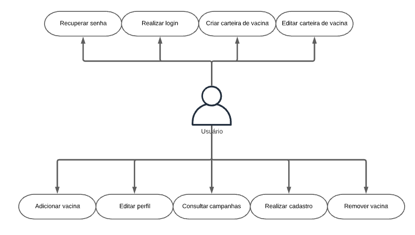
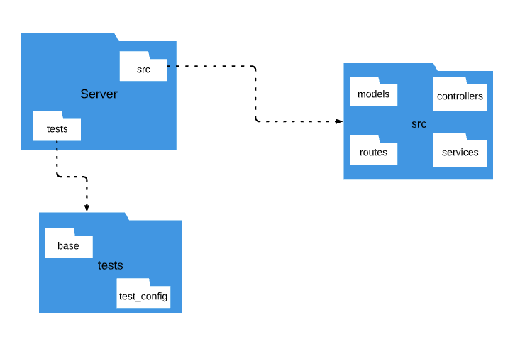
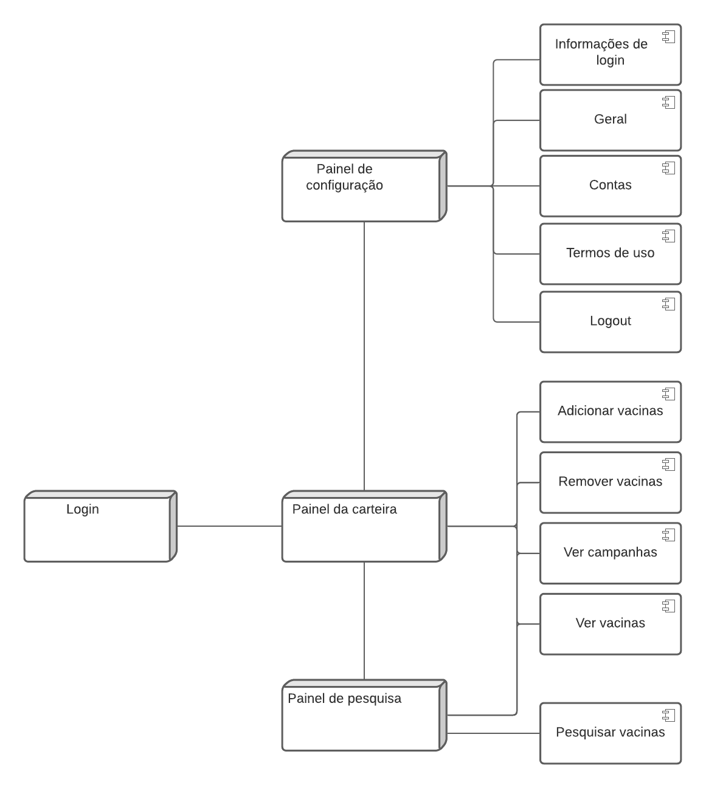
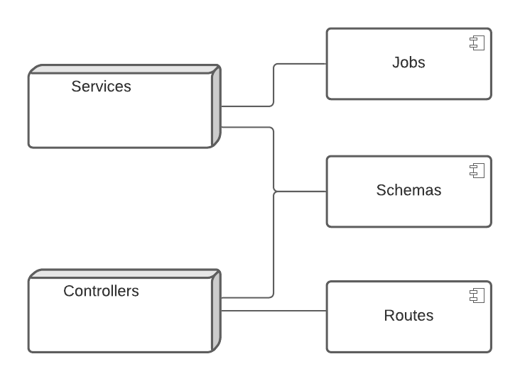

## Histórico de Versões
| Versão  |  Data  | Autor  |  Descrição  |
| ------------------- | ------------------- | ------------------- | ------------------- |
|  1.0 |  26/02/2020 | Ciro Costa, Gabriel Luiz |  Criação documento de arquitetura |
|  1.1 |  05/03/2021 | Guilherme Rogelin, Erick |  Adição de tópicos e correção |
|  1.2 |  08/03/2021 | Guilherme Rogelin, Erick |  Adição de tópicos |

## Sumário
[1.  **Introdução**](#_1-Introdução)
- [1.1 Finalidade](#_11-Finalidade)
- [1.2 Escopo](#_12-Escopo)
- [1.3 Definições, Acrônimos e Abreviações](#_13-Definições-Acrônimos-e-Abreviações)
- [1.4 Visão Geral](#_14-Visão-Geral)  

[2. **Representação Arquitetural**](#_2-Representação-Arquitetural)
- [2.1 Diagrama de Relações](#_21-Diagrama-de-Relações)
- [2.2 Representação dos Serviços](#_22-Representação-dos-Serviços)
- [2.2.1 Frontend](#_221-Frontend)
- [2.2.2 Backend](#_222-Backend)
- [2.3 Tecnologias](#_23-Tecnologias)
- [2.3.1 Flutter](#_231-Flutter)
- [2.3.2 Node.js](#_232-Nodejs)
- [2.3.3 MongoDB](#_233-MongoDB)
- [2.3.4 Docker](#_234-Docker)
- [2.3.5 Docker Compose](#_235-Docker-Compose)  

[3. **Metas e Restrições da Arquiteura**](#_3-Metas-e-Restrições-da-Arquiteura)
- [3.1 Metas](#_31-Metas)
- [3.2 Restrições Tecnológicas](#_32-Restrições-Tecnológicas)  

[4. **Visão de Casos de Uso**](#_4-Visão-de-Casos-de-Uso)
- [4.1. Realização de Casos de Uso](#_41-Realização-de-Casos-de-Uso)  

[5. Visão Lógica](#_5-Visão-Lógica)
- [5.1. Visão Geral](#_51-Visão-Geral)
- [5.2. Pacotes de Design Significativos do Ponto de Vista da Arquitetura](#_52-Pacotes-de-Design-Significativos-do-Ponto-de-Vista-da-Arquitetura)
- [5.3. Visão da Implantação](#_53-Visão-da-Implantação)
- [5.3.1 Frontend](#_531-Frontend)
- [5.3.2 Backend](#_532-Backend)

<!-- 6. Tamanho e Desempenho
7. Qualidade
- 7.1 Precisão
- 7.2 Confiabilidade
- 7.3 Eficiência
- 7.4 Integridade
- 7.5 Usabilidade
- 7.6 Manutenibilidade
- 7.7 Testabilidade
- 7.8 Flexibilidade
- 7.9 Portabilidade -->

## 1. Introdução

### 1.1 Finalidade
Este documento tem como finalidade fornecer uma visão geral da arquitetura do e-vacina, utilizando-se de diversas visões arquiteturais a fim de facilitar o entendimento dos processos e funcionamento de todo o sistema. Tem também como objetivo transmitir as decisões arquiteturais significativas tomadas em relação ao mesmo.

### 1.2 Escopo
 Através desse documento, é possível obter um melhor entendimento da arquitetura do e-vacina, permitindo ao leitor compreender o funcionamento de seu sistema, como também a abordagem utilizada para o seu desenvolvimento.

### 1.3 Definições, Acrônimos e Abreviações

Abreviação | Significado
---------- | -----------
UNB        |  Universidade de Brasília
FGA        |	Faculdade do Gama
MDS        |	Métodos de Desenvolvimento de Software
SDK        |  Software Development Kit

###  1.4 Visão Geral
São apresentados nesse documento os detalhes arquiteturais de como o sistema deverá se comportar em diferentes processos e informações acerca das tecnologias implantadas.
## 2. Representação Arquitetural
###  2.1 Diagrama de Relações

O diagrama representa uma arquitetura cliente-servidor que divide a aplicação em dois módulos, sendo um para os clientes, responsáveis por sua execução, e o outro para o servidor, contendo seus processos executados em um servidor. A comunicação entre os módulos é feita por requisições HTTP.  

Cada módulo será feito em repositórios diferentes com configurações diferentes.
###  2.2 Representação dos Serviços
#### 2.2.1 Frontend
 Frontend do e-vacina é responsavel por toda a interação com o usuário. Ele apresenta uma interface gráfica que habilita o usuário a usar todas as funções do sistema.

Interagindo com o Frontend o usuário terá acesso ao núcleo das funcionalidades do e-vacina, sendo elas principalmente: checar dados de vacinas, checar caderno de vacinação, entrar e criar usuarios, marcar vacinas tomadas, ver vacinas tomadas. 

#### 2.2.2 Backend
  O Backend do e-vacina é o responsável pela funcionalidade das principais características do sistema. Através de requisições feitas pelo Frontend, o Backend irá realizar as pesquisas feitas pelo usuário, armazenar e editar contas de usuários, vacinas, caderno de vacinação e autenticação de usuário.

### 2.3 Tecnologias
 #### 2.3.1 Flutter
 Flutter é um kit de desenvolvimento de interface de usuário, de código aberto, criado pelo Google, que possibilita a criação de aplicativos compilados nativamente.
 #### 2.3.2 Node.js
 Node.js foi projetado para construir aplicativos de rede escalonáveis.O código de Node.js é baseado na arquitetura event-driven, capaz de entrada/saída assíncrona. Otimizado para ser corrido em tempo real tratando-se também de um ditribuído
 #### 2.3.3 MongoDB
 O MongoDB é um gerenciador de banco de dados não relacional que proporciona forte confiabilidade, robustez de recursos, flexibilidade e desempenho.
 #### 2.3.4 Docker
 Docker é uma plataforma, open-source para criação, execução e deploy de contêineres. Esses contêineres são pacotes da aplicação contendo suas dependências, bibliotecas e arquivos de configuração.
 #### 2.3.5 Docker Compose
 Docker Compose é um orquestrador de contêineres Docker. Com ele é possível gerenciar vários contêineres de uma única vez, definindo o comportamente de cada um deles.
## 3. Metas e Restrições da Arquiteura
### 3.1 Metas
O projeto possui como objetivo uma carteira de vacinação digital que irá facilitar o controle de vacinas da população geral.

### 3.2 Restrições Tecnológicas
Para o desenvolvimento do e-vacina serão utitilizados as seguintes tecnologias:

Flutter: SDK de frontend para a criação do app;

Dart: Linguagem para desenvolvimento com Flutter;

Node.js: Ambiente de execução server side;

JavaScript: Linguagem utilizada em conjunto com o Node.js;

MongoDB: Sistema de gerenciamento de banco de dados não relacional;

Docker: Ambiente de empacotamento da aplicação;

Docker Compose: Orquestrador de contêineres Docker.
## 4. Visão de Casos de Uso
A documentação de caso de uso visa especificar o comportamento do sistema do ponto de vista do usuário.

- Realizar cadastro
- Realizar login
- Recuperar senha
- Criar carteira de vacina
- Editar carteira de vacina
- Adicionar vacina
- Remover vacina
- Editar perfil
- Consultar campanhas
- Verificar validades

### 4.1. Realização de Casos de Uso

|     Casos de uso         |    Autor    | Realização |
|------------------------- | ----------- | ----------- |
|Realizar cadastro         |   Usuário   | O usuário deve cadastrar seu nome, CPF, data de nascimento, sexo, email e senha opcional. |
|Realizar login            |   Usuário   | O usuário irá preencher seu email e senha informados no cadastro. |
|Recuperar senha           |   Usuário   | O usuário receberá um email de confirmação e poderá criar uma nova senha. |
|Criar carteira de vacina  |   Usuário   | O usuário deve informar todas as vacinas já tomadas e suas respectivas datas. |
|Editar carteira de vacina |   Usuário   | O usuário poderá editar sua carteira adicionando ou removendo uma vacina. |
|Adicionar vacina          |   Usuário   | O usuário deve informar o nome da vacina e sua data para adicioná-la em sua carteira. |
|Remover vacina            |   Usuário   | O usuário poderá remover uma vacina já vencida de sua carteira. |
|Editar perfil             |   Usuário   | O usuário poderá editar seu próprio perfil e mudar informações pessoais. |
|Consultar campanhas       |   Usuário   | O usuário receberá notificações de campanhas de vacinação e poderá consultá-las. |
|Verificar validades       |   Usuário   | O usuário receberá notificações de vacinas próximo à data de vencimento. |

## 5. Visão Lógica
###  5.1. Visão Geral
O aplicativo baseia-se em uma arquitetura de objetos que possuem uma relação dinâmica entre si, o que permite o acesso de funcionalidades entre pacotes e classes e facilita a manutenção. O usuário interage com o cadastro, que irá verificar se já existe algum usuário cadastrado com aquelas informações, ou interage com o login, que irá buscar as informações preenchidas em um banco de dados e permitirá o acesso ao aplicativo. Em seguida ele interage com as vacinas, podendo editar sua carteira de vacinação, verificar validade de suas vacinas e acompanhar campanhas de vacinação.

###  5.2. Pacotes de Design Significativos do Ponto de Vista da Arquitetura  
  A aplicação no Front End será feita em Flutter. No diagrama abaixo mostra como será a estrutura básica de pacotes do nosso aplicativo.   
    
  O Back End será feito em NodeJs. No diagrama abaixo mostra como será a estrutura básica de pacotes
  

###  5.3. Visão da Implantação 
  ####  5.3.1 Frontend 
  O Frontend é baseado completamente linguagem Dart juntamente com o Flutter.

    
  ####  5.3.1 Backend
  O Backend é baseado completamente em Node.js, JavaScript e MongoDB.

  

<!-- ## 6. Tamanho e Desempenho
## 7. Qualidade
### 7.1 Precisão
### 7.2 Confiabilidade
### 7.3 Eficiência
### 7.4 Integridade
### 7.5 Usabilidade
### 7.6 Manutenibilidade
### 7.7 Testabilidade
### 7.8 Flexibilidade
### 7.9 Portabilidade -->  
